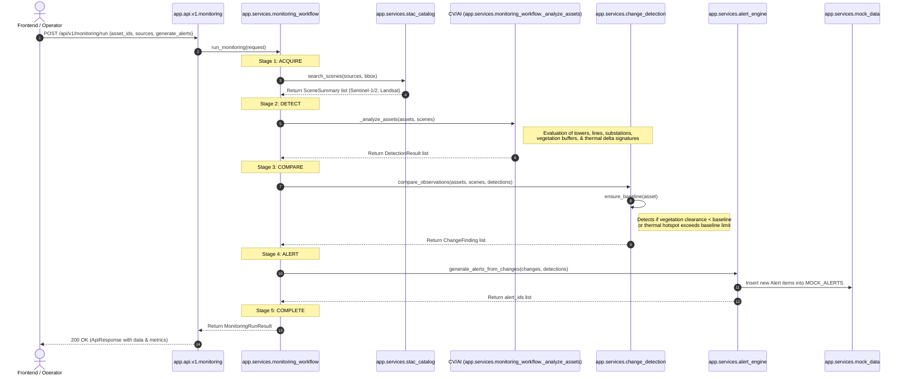

# TAMS Backend Architecture, Data Flow & User Journey Guide

Welcome to the **Transmission Asset Intelligence & Monitoring Platform (TAMS) Backend Documentation**. This document provides a detailed breakdown of the backend system architecture, file structure, module purposes, end-to-end data flow, and user journeys.

---

## 1. System Architecture Overview

The TAMS backend is built as a high-performance **FastAPI** application serving RESTful APIs to the GIS frontend. The backend utilizes a modular layered architecture to handle transmission asset management, satellite data acquisition via STAC catalog queries, change detection, and automated alert triggering.

```
┌────────────────────────────────────────────────────────┐
│                      GIS Frontend                      │
└───────────────────────────┬────────────────────────────┘
                            │ (REST HTTP Requests)
                            ▼
┌────────────────────────────────────────────────────────┐
│                   app.main (FastAPI)                   │
└───────────────────────────┬────────────────────────────┘
                            ▼
┌────────────────────────────────────────────────────────┐
│                 app.api.v1 (Routers)                   │
│   (assets, alerts, analytics, imagery, monitoring)     │
└───────────────────────────┬────────────────────────────┘
                            ▼
┌────────────────────────────────────────────────────────┐
│            app.services (Orchestration & logic)        │
│ ┌──────────────────────┐    ┌────────────────────────┐ │
│ │ monitoring_workflow  ├───►│       stac_catalog     │ │
│ └──────────┬───────────┘    └───────────┬────────────┘ │
│            │                            ▼              │
│            │                ┌────────────────────────┐ │
│            │                │     sentinel2_night    │ │
│            ▼                └────────────────────────┘ │
│ ┌──────────────────────┐    ┌────────────────────────┐ │
│ │   change_detection   ├───►│      alert_engine      │ │
│ └──────────────────────┘    └────────────────────────┘ │
└───────────────────────────┬────────────────────────────┘
                            ▼
┌────────────────────────────────────────────────────────┐
│             Data Layer (app.services.mock_data)        │
└────────────────────────────────────────────────────────┐
```

---

## 2. Directory Structure

The backend application files are structured as follows:

```text
backend/
├── app/
│   ├── __init__.py
│   ├── main.py                    # FastAPI Entrypoint
│   ├── api/                       # API Route Controllers
│   │   └── v1/
│   │       ├── __init__.py        # Versioned Router Aggregation
│   │       ├── assets.py          # Assets (Towers, Substation) API
│   │       ├── alerts.py          # Crew Alerts API
│   │       ├── analytics.py       # Dashboard Analytics API
│   │       ├── imagery.py         # Night-time Imagery Campaign API
│   │       └── monitoring.py      # Active Monitoring Workflows API
│   ├── core/                      # System Configurations
│   │   ├── __init__.py
│   │   ├── config.py          # Settings & Env Configuration
│   │   └── logging.py         # Structured Logging System
│   ├── db/                        # Database Sessions
│   │   └── database.py        # SQLAlchemy Setup
│   ├── models/                    # DB Tables
│   │   └── __init__.py
│   ├── schemas/                   # Pydantic Request/Response Models
│   │   ├── asset.py
│   │   ├── imagery.py
│   │   ├── monitoring.py
│   │   └── response.py        # Generic API Wrappers
│   └── services/                  # Business Logic & Workflows
│       ├── __init__.py
│       ├── alert_engine.py        # Rules-based Alert Generation
│       ├── change_detection.py    # Baseline Deviation Engine
│       ├── mock_data.py           # In-memory DB for Dev/Demo
│       ├── monitoring_workflow.py # Pipeline Orchestrator (Acquire->Detect->Compare->Alert)
│       ├── sentinel2_night.py     # Sentinel-2 Night Data Service
│       ├── stac_catalog.py        # Copernicus STAC API Client
│       └── substation_catalog.py  # Geographic Substation Geometries (focus on India GRID)
└── requirements-local.txt         # Dev Package Manifest
```

---

## 3. File-by-File Purpose Guide

### Core App Entrypoint
* **[main.py](file:///c:/Users/shivam.nikam/Desktop/Full%20stack/TAMS/backend/app/main.py):** Initializes the FastAPI app, configures CORS policies (allowing local and wildcard production staging origins), mounts middleware (like `TrustedHostMiddleware`), includes the v1 API router, and exposes base health checking and root endpoints.

### API Controllers (`app/api/v1/`)
* **[api/v1/\_\_init\_\_.py](file:///c:/Users/shivam.nikam/Desktop/Full%20stack/TAMS/backend/app/api/v1/__init__.py):** Aggragates individual domain routers into a single `/api/v1` namespace. Exposes `/status` endpoint returning the operational state and satellite capabilities.
* **[assets.py](file:///c:/Users/shivam.nikam/Desktop/Full%20stack/TAMS/backend/app/api/v1/assets.py):** Exposes `GET /assets` (paginated and filtered listing of transmission towers, lines, and substations), `GET /assets/{asset_id}` (retrieving details of a specific asset), and `POST /assets` (registering new structures).
* **[alerts.py](file:///c:/Users/shivam.nikam/Desktop/Full%20stack/TAMS/backend/app/api/v1/alerts.py):** Handles alert operations. Exposes `GET /alerts` (filtered list by priority and status) and `PATCH /alerts/{alert_id}/acknowledge` (marks open issues as acknowledged by utility crews).
* **[analytics.py](file:///c:/Users/shivam.nikam/Desktop/Full%20stack/TAMS/backend/app/api/v1/analytics.py):** Exposes `GET /analytics/overview` (high-level KPIs, asset counts, regional distribution, and open alerts) and `GET /analytics/risk` (summarized hazard statistics, weather risk, and outage probability).
* **[imagery.py](file:///c:/Users/shivam.nikam/Desktop/Full%20stack/TAMS/backend/app/api/v1/imagery.py):** Specialized endpoints for Sentinel-2 Night-Time Acquisition Campaigns. Exposes search methods over Copernicus collections, processing pipeline specifications, and raw/orthorectified product types.
* **[monitoring.py](file:///c:/Users/shivam.nikam/Desktop/Full%20stack/TAMS/backend/app/api/v1/monitoring.py):** Manages active monitoring runs. Exposes `POST /monitoring/run` (triggers a synchronous monitoring run on selected assets), `GET /monitoring/runs` (retrieves run history), and `GET /monitoring/catalog` (generic multi-satellite STAC catalog search).

### Configuration & Database (`app/core/` & `app/db/`)
* **[config.py](file:///c:/Users/shivam.nikam/Desktop/Full%20stack/TAMS/backend/app/core/config.py):** Utilizes `pydantic-settings` to load configurations from environment variables or `.env`. Defines CORS origins, database connection pools, Redis parameters, AWS access credentials, and Copernicus STAC settings.
* **[logging.py](file:///c:/Users/shivam.nikam/Desktop/Full%20stack/TAMS/backend/app/core/logging.py):** Setup logging formatters using `python-json-logger` for structured JSON logs in production, and clean standard console logging in debug mode.
* **[database.py](file:///c:/Users/shivam.nikam/Desktop/Full%20stack/TAMS/backend/app/db/database.py):** Declares SQLAlchemy asynchronous engine and session factory (`create_async_engine`). Integrates with PostgreSQL database using the `asyncpg` driver.

### Validation Schemas (`app/schemas/`)
* **[asset.py](file:///c:/Users/shivam.nikam/Desktop/Full%20stack/TAMS/backend/app/schemas/asset.py):** Validates payload bounds (e.g. coordinates within GPS bounds) and output attributes for assets. Exposes `AssetTypeEnum`, `AssetStatusEnum`, `HealthScoreEnum`, `AssetCreate`, and `AssetResponse`.
* **[imagery.py](file:///c:/Users/shivam.nikam/Desktop/Full%20stack/TAMS/backend/app/schemas/imagery.py):** Models Sentinel-2 night campaign items, S3 metadata paths, and orthorectified processing pipeline steps.
* **[monitoring.py](file:///c:/Users/shivam.nikam/Desktop/Full%20stack/TAMS/backend/app/schemas/monitoring.py):** Defines request and result structures for runs. Contains schemas for `SceneSummary`, `DetectionResult`, `ChangeFinding`, and `MonitoringRunResult`.
* **[response.py](file:///c:/Users/shivam.nikam/Desktop/Full%20stack/TAMS/backend/app/schemas/response.py):** Implements a unified API envelope structure containing `data`, `errors`, and `meta` (timestamp, API version, request tracing UUID, and `PaginationMeta`).

### Business Logic Services (`app/services/`)
* **[monitoring_workflow.py](file:///c:/Users/shivam.nikam/Desktop/Full%20stack/TAMS/backend/app/services/monitoring_workflow.py):** Pipeline Orchestrator. Coordinates the multi-step cycle: resolves assets, queries STAC scenes, invokes detections, correlates changes, and triggers alarms.
* **[stac_catalog.py](file:///c:/Users/shivam.nikam/Desktop/Full%20stack/TAMS/backend/app/services/stac_catalog.py):** Clients for the CDSE STAC search. Queries Sentinel-1 (radar), Sentinel-2 (optical), Landsat 9 (optical + thermal), and Sentinel-2 night campaigns. Uses static reference fallbacks when STAC servers are unavailable.
* **[sentinel2_night.py](file:///c:/Users/shivam.nikam/Desktop/Full%20stack/TAMS/backend/app/services/sentinel2_night.py):** Connects to the Copernicus `sentinel-2-night-time-acquisitions` collection. Includes coordinates of reference scenes (e.g. San Diego power line segment, oil flares in Saudi Arabia) and documents the raw L1B reprocessing steps (Sen2VM geolocations, GDAL resamplings, and Rasterio detector merges).
* **[substation_catalog.py](file:///c:/Users/shivam.nikam/Desktop/Full%20stack/TAMS/backend/app/services/substation_catalog.py):** A curated database of key power transmission grid substations across India (POWERGRID, state backbones like Rohini, Kalwa, Nelamangala, Chevella, Wardha) and global regions. Dynamically generates square spatial bounding footprints.
* **[change_detection.py](file:///c:/Users/shivam.nikam/Desktop/Full%20stack/TAMS/backend/app/services/change_detection.py):** Analyzes current detections against historical baselines (`BASELINES`) to identify reductions in clearance distances, elevated thermal signatures, and radar backscatter fluctuations.
* **[alert_engine.py](file:///c:/Users/shivam.nikam/Desktop/Full%20stack/TAMS/backend/app/services/alert_engine.py):** Implements rules to map anomalies to formal alarms (e.g. "Vegetation within safety clearance", "Anpara 765kV transformer overload", "Wildfire risk detected").
* **[mock_data.py](file:///c:/Users/shivam.nikam/Desktop/Full%20stack/TAMS/backend/app/services/mock_data.py):** Acts as the virtual database (DB) storing assets, alerts, risk thresholds, and maintenance logs for development and interactive demos.

---

## 4. End-to-End Data Flow

The central operation of the TAMS platform is the **Monitoring Cycle**. The flowchart below details the sequential data path:



---

## 5. Main User Journeys

### Journey A: Run Corridor Monitoring Campaign
1. **Trigger:** The Utility Operator opens the dashboard, selects a subset of assets (e.g. "Nelamangala 765kV Grid Segment"), and clicks **Run Monitoring**.
2. **Backend Processing:**
   * Receives `asset_ids` and requested imagery sources (e.g. `sentinel-2`, `sentinel-1`).
   * Queries Copernicus Space STAC for recent imagery overlapping the corridor.
   * Runs the heuristic model on assets: checks if recent imagery flags issues.
   * Runs change detection to see if vegetation height has grown closer to conductors since the last pass.
   * Generates active alerts and saves the campaign run logs.
3. **Outcome:** Frontend visualizes the active progress of stages (`acquire` → `detect` → `compare` → `alert` → `complete`) and refreshes the map.

### Journey B: Vegetation Safety Clearance Violation
1. **Trigger:** An automated schedule triggers a weekly run over the **Pune Chakan industrial corridor segment**.
2. **Backend Processing:**
   * STAC catalog returns a new cloud-free Sentinel-2 optical scene.
   * The detection pass identifies a high-risk vegetation pixel cluster encroaching on the conductors buffer.
   * `_analyze_assets` registers a vegetation detection with a calculated clearance of **2.1 meters**.
   * `compare_observations` determines that this is a severe drop from the **12.0m baseline**. It creates a `vegetation_encroachment` `ChangeFinding`.
   * `alert_engine` matches this finding, creating `alert-XXXX` with **high priority** and logs: *"Satellite analysis detected vegetation within 2.1m of conductors."*
3. **Outcome:** A new **high-priority alert** appears on the crew dashboard, prompting dispatch of trimmers to clear the Right of Way (ROW).

### Journey C: Equipment Thermal Hotspot Detection
1. **Trigger:** The operator views the **Sentinel-2 Night-Time Acquisition** panel to check on high-load substations.
2. **Backend Processing:**
   * Query retrieves night scenes matching **Anpara 765kV** or **Mumbai Kalwa 400kV** stations.
   * Detection step parses thermal anomalies, identifying a thermal delta signature of **0.35** over the substation transformer banks.
   * `change_detection` flags a thermal delta exceeding the threshold.
   * `alert_engine` triggers a **critical alert**: *"Night/optical thermal analysis shows elevated signature (delta 0.35). Correlate with SCADA loading data."*
3. **Outcome:** Maintenance scheduler correlates the thermal anomaly with high transformer loading and plans a load-shedding route.

### Journey D: Dispatch Review & Alert Acknowledgment
1. **Trigger:** Operator reviews open issues in the dashboard.
2. **Backend Processing:**
   * Frontend calls `GET /api/v1/alerts?status=open`.
   * Operator reviews the details for `alert-001` (hotspot at Tower TX-102) and clicks **Acknowledge**.
   * Frontend calls `PATCH /api/v1/alerts/alert-001/acknowledge`.
   * Backend changes the alert status to `"acknowledged"` and timestamps `acknowledged_at` in the memory database.
3. **Outcome:** The alert moves to the active/in-progress section of the GIS dashboard.

---

## 6. How to Configure & Run the Backend

### Environment Configuration
Create a `.env` file in the `backend/` directory (see [config.py](file:///c:/Users/shivam.nikam/Desktop/Full%20stack/TAMS/backend/app/core/config.py) for all variables). Default configuration options include:
```bash
DEBUG=True
PORT=8000
ENABLE_CDSE_STAC=False  # Set to True to query live Copernicus Space STAC API
CDSE_S3_ACCESS_KEY=your_key
CDSE_S3_SECRET_KEY=your_secret
```

### Start Backend Development Server
Run the local dev command from the root directory:
```bash
npm.cmd run dev:backend
```
*Alternatively, run Python directly:*
```bash
cd backend
venv\Scripts\python -m uvicorn app.main:app --reload
```

### API Documentation Links
Once started, the interactive docs are available locally at:
* **Swagger UI:** [http://localhost:8000/docs](http://localhost:8000/docs)
* **ReDoc:** [http://localhost:8000/redoc](http://localhost:8000/redoc)
