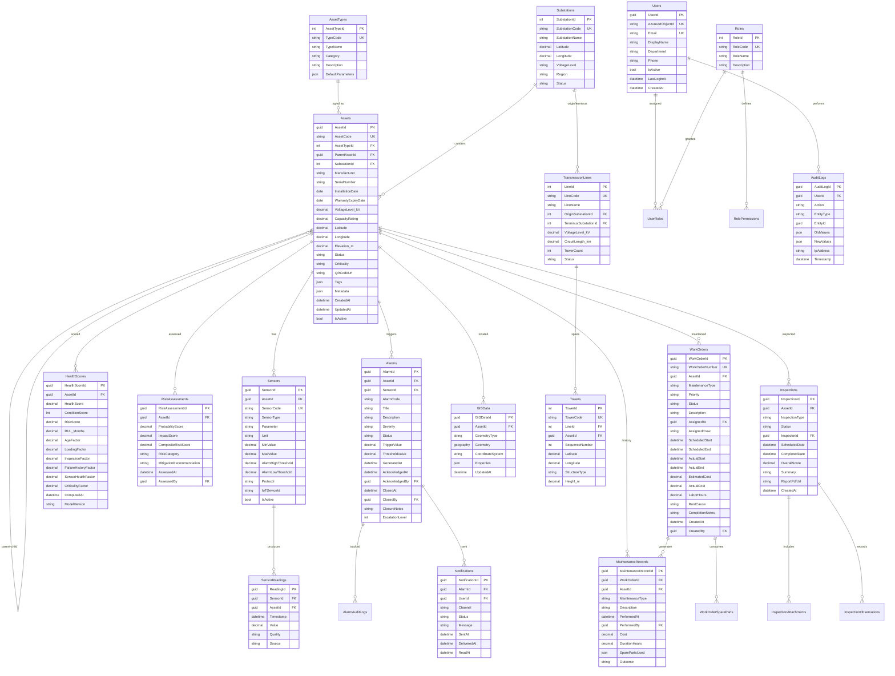

# Database Design & ER Model
## Transmission Asset Monitoring System (TAMS)

**Document ID:** TAMS-DB-001  
**Version:** 1.0  
**Date:** July 2026

---

## 1. Database Strategy

| Store | Engine | Purpose | Retention |
|-------|--------|---------|-----------|
| Operational | Azure SQL Server | Transactional data, relationships, audit | 7+ years |
| Time-Series | Azure Data Explorer | Sensor readings, score history | Hot 90d, warm 2y, cold 7y |
| Media | Azure Blob Storage | Images, videos, reports | Asset lifecycle + 3y |
| Cache | Redis | Session, dashboard cache | TTL-based |

---

## 2. Entity-Relationship Diagram



---

## 3. Table Definitions

### 3.1 Assets

```sql
CREATE TABLE dbo.Assets (
    AssetId             UNIQUEIDENTIFIER PRIMARY KEY DEFAULT NEWSEQUENTIALID(),
    AssetCode           NVARCHAR(50)    NOT NULL,
    AssetTypeId         INT             NOT NULL,
    ParentAssetId       UNIQUEIDENTIFIER NULL,
    SubstationId        INT             NULL,
    Manufacturer        NVARCHAR(200)   NULL,
    SerialNumber        NVARCHAR(100)   NULL,
    InstallationDate    DATE            NULL,
    WarrantyExpiryDate  DATE            NULL,
    VoltageLevel_kV     DECIMAL(10,2)   NULL,
    CapacityRating      DECIMAL(12,4)   NULL,
    CapacityUnit        NVARCHAR(20)    NULL,
    Latitude            DECIMAL(9,6)    NULL,
    Longitude           DECIMAL(9,6)    NULL,
    Elevation_m         DECIMAL(8,2)    NULL,
    Status              NVARCHAR(20)    NOT NULL DEFAULT 'InService',
    Criticality         NVARCHAR(20)    NOT NULL DEFAULT 'Medium',
    QRCodeUrl           NVARCHAR(500)   NULL,
    Tags                NVARCHAR(MAX)   NULL,  -- JSON array
    Metadata            NVARCHAR(MAX)   NULL,  -- JSON extensible
    IsActive            BIT             NOT NULL DEFAULT 1,
    CreatedAt           DATETIME2       NOT NULL DEFAULT SYSUTCDATETIME(),
    UpdatedAt           DATETIME2       NOT NULL DEFAULT SYSUTCDATETIME(),
    CreatedBy           UNIQUEIDENTIFIER NULL,
    UpdatedBy           UNIQUEIDENTIFIER NULL,

    CONSTRAINT UQ_Assets_AssetCode UNIQUE (AssetCode),
    CONSTRAINT FK_Assets_AssetType FOREIGN KEY (AssetTypeId) REFERENCES dbo.AssetTypes(AssetTypeId),
    CONSTRAINT FK_Assets_Parent FOREIGN KEY (ParentAssetId) REFERENCES dbo.Assets(AssetId),
    CONSTRAINT FK_Assets_Substation FOREIGN KEY (SubstationId) REFERENCES dbo.Substations(SubstationId),
    CONSTRAINT CK_Assets_Status CHECK (Status IN ('Planned','Installed','InService','Maintenance','Decommissioned')),
    CONSTRAINT CK_Assets_Criticality CHECK (Criticality IN ('Critical','High','Medium','Low'))
);
```

### 3.2 AssetTypes

```sql
CREATE TABLE dbo.AssetTypes (
    AssetTypeId     INT IDENTITY(1,1) PRIMARY KEY,
    TypeCode        NVARCHAR(50)  NOT NULL,
    TypeName        NVARCHAR(200) NOT NULL,
    Category        NVARCHAR(50)  NOT NULL,
    Description     NVARCHAR(500) NULL,
    DefaultParameters NVARCHAR(MAX) NULL,
    IsActive        BIT NOT NULL DEFAULT 1,

    CONSTRAINT UQ_AssetTypes_Code UNIQUE (TypeCode)
);
```

### 3.3 Sensors

```sql
CREATE TABLE dbo.Sensors (
    SensorId            UNIQUEIDENTIFIER PRIMARY KEY DEFAULT NEWSEQUENTIALID(),
    AssetId             UNIQUEIDENTIFIER NOT NULL,
    SensorCode          NVARCHAR(50)  NOT NULL,
    SensorType          NVARCHAR(50)  NOT NULL,
    Parameter           NVARCHAR(100) NOT NULL,
    Unit                NVARCHAR(20)  NOT NULL,
    MinValue            DECIMAL(18,6) NULL,
    MaxValue            DECIMAL(18,6) NULL,
    AlarmHighThreshold  DECIMAL(18,6) NULL,
    AlarmLowThreshold   DECIMAL(18,6) NULL,
    Protocol            NVARCHAR(20)  NULL,
    IoTDeviceId         NVARCHAR(200) NULL,
    IsActive            BIT NOT NULL DEFAULT 1,
    CreatedAt           DATETIME2 NOT NULL DEFAULT SYSUTCDATETIME(),

    CONSTRAINT UQ_Sensors_Code UNIQUE (SensorCode),
    CONSTRAINT FK_Sensors_Asset FOREIGN KEY (AssetId) REFERENCES dbo.Assets(AssetId)
);
```

### 3.4 Alarms

```sql
CREATE TABLE dbo.Alarms (
    AlarmId         UNIQUEIDENTIFIER PRIMARY KEY DEFAULT NEWSEQUENTIALID(),
    AssetId         UNIQUEIDENTIFIER NOT NULL,
    SensorId        UNIQUEIDENTIFIER NULL,
    AlarmCode       NVARCHAR(50)  NOT NULL,
    Title           NVARCHAR(200) NOT NULL,
    Description     NVARCHAR(1000) NULL,
    Severity        NVARCHAR(20)  NOT NULL,
    Status          NVARCHAR(20)  NOT NULL DEFAULT 'Active',
    TriggerValue    DECIMAL(18,6) NULL,
    ThresholdValue  DECIMAL(18,6) NULL,
    GeneratedAt     DATETIME2 NOT NULL DEFAULT SYSUTCDATETIME(),
    AcknowledgedAt  DATETIME2 NULL,
    AcknowledgedBy  UNIQUEIDENTIFIER NULL,
    ClosedAt        DATETIME2 NULL,
    ClosedBy        UNIQUEIDENTIFIER NULL,
    ClosureNotes    NVARCHAR(1000) NULL,
    EscalationLevel INT NOT NULL DEFAULT 0,

    CONSTRAINT FK_Alarms_Asset FOREIGN KEY (AssetId) REFERENCES dbo.Assets(AssetId),
    CONSTRAINT FK_Alarms_Sensor FOREIGN KEY (SensorId) REFERENCES dbo.Sensors(SensorId),
    CONSTRAINT CK_Alarms_Severity CHECK (Severity IN ('Critical','High','Medium','Low')),
    CONSTRAINT CK_Alarms_Status CHECK (Status IN ('Active','Acknowledged','InProgress','Closed','Suppressed'))
);
```

### 3.5 WorkOrders

```sql
CREATE TABLE dbo.WorkOrders (
    WorkOrderId       UNIQUEIDENTIFIER PRIMARY KEY DEFAULT NEWSEQUENTIALID(),
    WorkOrderNumber   NVARCHAR(20) NOT NULL,
    AssetId           UNIQUEIDENTIFIER NOT NULL,
    MaintenanceType   NVARCHAR(10) NOT NULL,
    Priority          NVARCHAR(20) NOT NULL DEFAULT 'Medium',
    Status            NVARCHAR(20) NOT NULL DEFAULT 'Draft',
    Description       NVARCHAR(2000) NULL,
    AssignedTo        UNIQUEIDENTIFIER NULL,
    AssignedCrew      NVARCHAR(200) NULL,
    ScheduledStart    DATETIME2 NULL,
    ScheduledEnd      DATETIME2 NULL,
    ActualStart       DATETIME2 NULL,
    ActualEnd         DATETIME2 NULL,
    EstimatedCost     DECIMAL(12,2) NULL,
    ActualCost        DECIMAL(12,2) NULL,
    LaborHours        DECIMAL(8,2) NULL,
    RootCause         NVARCHAR(500) NULL,
    CompletionNotes   NVARCHAR(2000) NULL,
    CreatedAt         DATETIME2 NOT NULL DEFAULT SYSUTCDATETIME(),
    CreatedBy         UNIQUEIDENTIFIER NULL,

    CONSTRAINT UQ_WorkOrders_Number UNIQUE (WorkOrderNumber),
    CONSTRAINT FK_WorkOrders_Asset FOREIGN KEY (AssetId) REFERENCES dbo.Assets(AssetId),
    CONSTRAINT CK_WO_Type CHECK (MaintenanceType IN ('PM','PdM','CM','EM')),
    CONSTRAINT CK_WO_Status CHECK (Status IN ('Draft','Approved','Scheduled','Assigned','InProgress','Completed','Closed','Cancelled'))
);
```

### 3.6 HealthScores

```sql
CREATE TABLE dbo.HealthScores (
    HealthScoreId       UNIQUEIDENTIFIER PRIMARY KEY DEFAULT NEWSEQUENTIALID(),
    AssetId             UNIQUEIDENTIFIER NOT NULL,
    HealthScore         DECIMAL(5,2) NOT NULL,
    ConditionScore      INT NOT NULL,
    RiskScore           DECIMAL(5,2) NOT NULL,
    RUL_Months          DECIMAL(6,1) NULL,
    AgeFactor           DECIMAL(5,2) NULL,
    LoadingFactor       DECIMAL(5,2) NULL,
    InspectionFactor    DECIMAL(5,2) NULL,
    FailureHistoryFactor DECIMAL(5,2) NULL,
    SensorHealthFactor  DECIMAL(5,2) NULL,
    CriticalityFactor   DECIMAL(5,2) NULL,
    ComputedAt          DATETIME2 NOT NULL DEFAULT SYSUTCDATETIME(),
    ModelVersion        NVARCHAR(20) NULL,

    CONSTRAINT FK_HealthScores_Asset FOREIGN KEY (AssetId) REFERENCES dbo.Assets(AssetId),
    CONSTRAINT CK_HealthScore_Range CHECK (HealthScore BETWEEN 0 AND 100)
);
```

### 3.7 Users & Roles

```sql
CREATE TABLE dbo.Users (
    UserId          UNIQUEIDENTIFIER PRIMARY KEY DEFAULT NEWSEQUENTIALID(),
    AzureAdObjectId NVARCHAR(100) NOT NULL,
    Email           NVARCHAR(200) NOT NULL,
    DisplayName     NVARCHAR(200) NOT NULL,
    Department      NVARCHAR(100) NULL,
    Phone           NVARCHAR(20)  NULL,
    IsActive        BIT NOT NULL DEFAULT 1,
    LastLoginAt     DATETIME2 NULL,
    CreatedAt       DATETIME2 NOT NULL DEFAULT SYSUTCDATETIME(),

    CONSTRAINT UQ_Users_AAD UNIQUE (AzureAdObjectId),
    CONSTRAINT UQ_Users_Email UNIQUE (Email)
);

CREATE TABLE dbo.Roles (
    RoleId      INT IDENTITY(1,1) PRIMARY KEY,
    RoleCode    NVARCHAR(50) NOT NULL,
    RoleName    NVARCHAR(100) NOT NULL,
    Description NVARCHAR(500) NULL,

    CONSTRAINT UQ_Roles_Code UNIQUE (RoleCode)
);

CREATE TABLE dbo.UserRoles (
    UserRoleId  INT IDENTITY(1,1) PRIMARY KEY,
    UserId      UNIQUEIDENTIFIER NOT NULL,
    RoleId      INT NOT NULL,
    AssignedAt  DATETIME2 NOT NULL DEFAULT SYSUTCDATETIME(),

    CONSTRAINT FK_UserRoles_User FOREIGN KEY (UserId) REFERENCES dbo.Users(UserId),
    CONSTRAINT FK_UserRoles_Role FOREIGN KEY (RoleId) REFERENCES dbo.Roles(RoleId),
    CONSTRAINT UQ_UserRoles UNIQUE (UserId, RoleId)
);

CREATE TABLE dbo.RolePermissions (
    PermissionId    INT IDENTITY(1,1) PRIMARY KEY,
    RoleId          INT NOT NULL,
    Module          NVARCHAR(50) NOT NULL,
    Permission      NVARCHAR(50) NOT NULL,

    CONSTRAINT FK_RolePerm_Role FOREIGN KEY (RoleId) REFERENCES dbo.Roles(RoleId),
    CONSTRAINT UQ_RolePerm UNIQUE (RoleId, Module, Permission)
);
```

### 3.8 AuditLogs

```sql
CREATE TABLE dbo.AuditLogs (
    AuditLogId  UNIQUEIDENTIFIER PRIMARY KEY DEFAULT NEWSEQUENTIALID(),
    UserId      UNIQUEIDENTIFIER NULL,
    Action      NVARCHAR(50)  NOT NULL,
    EntityType  NVARCHAR(50)  NOT NULL,
    EntityId    UNIQUEIDENTIFIER NULL,
    OldValues   NVARCHAR(MAX) NULL,
    NewValues   NVARCHAR(MAX) NULL,
    IpAddress   NVARCHAR(45)  NULL,
    UserAgent   NVARCHAR(500) NULL,
    Timestamp   DATETIME2 NOT NULL DEFAULT SYSUTCDATETIME(),

    CONSTRAINT FK_AuditLogs_User FOREIGN KEY (UserId) REFERENCES dbo.Users(UserId)
);
```

### 3.9 GISData

```sql
CREATE TABLE dbo.GISData (
    GISDataId       UNIQUEIDENTIFIER PRIMARY KEY DEFAULT NEWSEQUENTIALID(),
    AssetId         UNIQUEIDENTIFIER NOT NULL,
    GeometryType    NVARCHAR(20) NOT NULL,
    Geometry        GEOGRAPHY NOT NULL,
    CoordinateSystem NVARCHAR(20) NOT NULL DEFAULT 'WGS84',
    Properties      NVARCHAR(MAX) NULL,
    UpdatedAt       DATETIME2 NOT NULL DEFAULT SYSUTCDATETIME(),

    CONSTRAINT FK_GISData_Asset FOREIGN KEY (AssetId) REFERENCES dbo.Assets(AssetId)
);
```

---

## 4. Azure Data Explorer (ADX) Tables

### 4.1 SensorReadings (Primary Time-Series)

```kusto
.create table SensorReadings (
    ReadingId: guid,
    SensorId: guid,
    AssetId: guid,
    AssetCode: string,
    Parameter: string,
    Timestamp: datetime,
    Value: real,
    Quality: string,
    Source: string
) with (partition by datetime, retentionpolicy = hot = 90d, warm = 730d, cold = 2555d)
```

### 4.2 HealthScoreHistory

```kusto
.create table HealthScoreHistory (
    AssetId: guid,
    AssetCode: string,
    HealthScore: real,
    ConditionScore: int,
    RiskScore: real,
    RUL_Months: real,
    ComputedAt: datetime,
    ModelVersion: string
) with (partition by datetime)
```

### 4.3 AlarmEvents

```kusto
.create table AlarmEvents (
    AlarmId: guid,
    AssetId: guid,
    Severity: string,
    EventType: string,
    Timestamp: datetime,
    UserId: guid,
    Details: dynamic
) with (partition by datetime)
```

---

## 5. Indexing Strategy

### 5.1 SQL Server Indexes

| Table | Index | Columns | Type | Purpose |
|-------|-------|---------|------|---------|
| Assets | IX_Assets_Type | AssetTypeId | Nonclustered | Filter by type |
| Assets | IX_Assets_Substation | SubstationId | Nonclustered | Substation view |
| Assets | IX_Assets_Parent | ParentAssetId | Nonclustered | Hierarchy traversal |
| Assets | IX_Assets_Status | Status, Criticality | Nonclustered | Dashboard filters |
| Assets | IX_Assets_Location | Latitude, Longitude | Nonclustered | Spatial queries |
| Sensors | IX_Sensors_Asset | AssetId | Nonclustered | Asset sensor lookup |
| Alarms | IX_Alarms_Status_Severity | Status, Severity, GeneratedAt DESC | Nonclustered | Alarm center |
| Alarms | IX_Alarms_Asset | AssetId, GeneratedAt DESC | Nonclustered | Asset alarm history |
| WorkOrders | IX_WO_Status | Status, ScheduledStart | Nonclustered | Maintenance queue |
| WorkOrders | IX_WO_Asset | AssetId | Nonclustered | Asset maintenance history |
| HealthScores | IX_Health_Asset | AssetId, ComputedAt DESC | Nonclustered | Latest score lookup |
| AuditLogs | IX_Audit_Timestamp | Timestamp DESC | Nonclustered | Audit search |
| AuditLogs | IX_Audit_Entity | EntityType, EntityId | Nonclustered | Entity audit trail |
| GISData | SPATIAL INDEX | Geometry | Spatial | Map queries |

### 5.2 ADX Partitioning

- **SensorReadings:** Partition by `Timestamp` (daily); distribute by `AssetId`
- **Retention:** Hot (SSD, 90 days) → Warm (HDD, 2 years) → Cold (Blob, 7 years)
- **Caching:** Hot cache 30 days for frequently queried assets

---

## 6. Data Volume Estimates

| Table | Rows (Year 1) | Row Size | Storage |
|-------|---------------|----------|---------|
| Assets | 20,000 | 2 KB | 40 MB |
| Sensors | 100,000 | 500 B | 50 MB |
| SensorReadings (ADX) | 1.8 billion | 100 B | ~180 GB |
| Alarms | 500,000 | 1 KB | 500 MB |
| WorkOrders | 50,000 | 2 KB | 100 MB |
| Inspections | 30,000 | 1 KB | 30 MB |
| HealthScores | 7.3 million | 500 B | 3.6 GB |
| AuditLogs | 2 million | 1 KB | 2 GB |

---

## 7. Referential Integrity Rules

| Rule | Description |
|------|-------------|
| No hard delete | Assets deactivated (IsActive=0), never deleted |
| Cascade restrict | Cannot delete asset with active alarms or open work orders |
| Audit on change | All CRUD on Assets, Alarms, WorkOrders logged to AuditLogs |
| Temporal data | SensorReadings immutable; corrections via new record with Quality='Corrected' |
| Hierarchy acyclic | ParentAssetId must not create circular references (checked via trigger) |

---

**Maintained By:** Database Architecture Team
